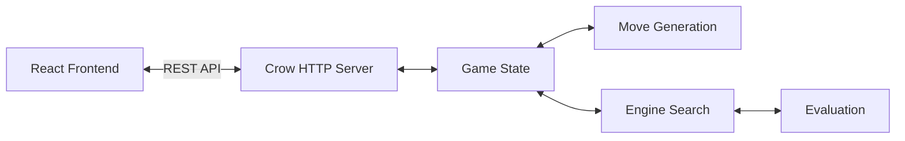

# Mc-Chess

A full-stack chess playing application supporting passand play, or play against a custom chess engine. 

Users can play against a friend, or try their hand against my custom written chess AI with adjustable engine depth (difficulty). 
## [Try it!](https://cmcgartl.github.io/Mc-Chess/)

## Tech Stack

Backend: C++17, Crow HTTP framework, CMake

Frontend: React, TypeScript, Vite, react-chessboard

Testing: Catch2

Deployment: Docker, GitHub Pages, Render
## What Is A Chess Engine/Chess AI?

For this project, I use the terms chess engine and AI almost synonymously. A chess engine is a program that takes a chess position as input, evaluates the strength of each player's position, and identifies the strongest moves available to the players.

A chess AI is simply a chess playing program that uses a chess engine to play against its opponent, typically a human. It is important to note that when I use the term "Chess AI", I am not referring to "AI" as the word has come to mean today. "AI" in modern discourse typically implies machine learning techniques that are a subset of a much more broad category. AI is just an umbrella term for methods that allow a computer to perform tasks that typically require human intelligence... like playing chess. 

More specifically, the Chess AI that I implemented is a brute force search AI, using an algorithm called [Minimax](https://www.geeksforgeeks.org/artificial-intelligence/mini-max-algorithm-in-artificial-intelligence/). At a high level, the engine works as follows:
- On the engine's turn, it generates all of the possible moves it can play in the current position
- For each possible move, the engine looks at the position that would result if the engine played that move.
- The engine generates all of the possible moves from this new position
- For each possible move, the engine looks at the position that would result if the engine played that move.

These steps repeat until the engine reaches a game over position or its move limit (maximum depth). At this point, the engine stops looking ahead, and evaluates the position it is currently at. The engine then selects the move that will result in the strongest evaluation for itself. 

# Architecture



## Main Architectural Decisions

**C++ backend with a React frontend over REST** — The engine is written in C++ for raw performance. Move generation and tree search involve millions of operations per move, and C++ gives direct control over memory layout and avoids garbage collection pauses. Rather than compiling to WebAssembly and running in the browser, the engine runs server-side and communicates with the frontend via a JSON REST API using the [Crow](https://crowcpp.org/) HTTP framework. This keeps the frontend thin and the engine independently deployable.

**Stateful server** — The game state (board, move history, position hashes) lives in memory on the backend. The frontend is a pure display layer — it sends moves and receives the full game state back, including the updated board, legal moves, and game status. This means all chess logic has a single source of truth, and the frontend never needs to validate or generate moves. The trade-off is that the server holds session state, so it's not horizontally scalable as-is.

**Move validation on the backend only** — The frontend knows which squares a piece can move to because the backend sends a `legalMoves` map in every response. The frontend never duplicates chess logic. This prevents desynchronization and keeps the codebase simpler.

**Make/unmake move pattern** — During search, the engine does not copy the board at each node. Instead, it applies a move in-place, recurses, then undoes the move using a saved `UndoInfo` snapshot. This keeps memory usage constant regardless of search depth and avoids expensive allocations in the hot loop.

**Incremental Zobrist hashing** — Rather than computing a full board hash from scratch (O(64) per position), the hash is updated incrementally with XOR operations as pieces move. This gives O(1) hash updates and powers both the transposition table and draw detection.

## Board Representation & Move Generation

The board is a flat array of 64 `Piece` structs, indexed 0–63 (a8=0, h1=63). Each piece stores a `PieceType` (Pawn, Knight, Bishop, Rook, Queen, King, None) and a `Color` (White, Black, None). Alongside the array, the engine maintains piece lists — vectors of white and black pieces — to avoid scanning all 64 squares when only a few pieces remain.

**Direction-based ray walking** — Sliding pieces (bishops, rooks, queens) generate moves by walking in a direction until hitting the board edge or another piece. A template function `walkDirectionsAndDo` takes a starting square, an array of direction offsets (e.g. `{7, -9, 9, -7}` for diagonals), and a lambda to execute at each square along the ray. This same function handles bishops, rooks, queens, knights, and pawns — the difference is just which directions are passed and whether movement is limited to one step.

**Pin detection via x-ray** — Pins are detected during the opponent's move generation phase. When a sliding piece walks toward the king and encounters exactly one friendly piece in the way, that piece is marked as pinned along that direction. Later, when generating the pinned piece's moves, only moves along the pin direction are allowed. The attack detection function also implements x-ray logic: if it encounters its own king while scanning for attackers, it continues looking past it. This ensures the engine correctly identifies squares that would be attacked if the king moved away.

**Check resolution** — When the king is in check, a separate code path generates only legal responses: king moves to safe squares, blocks of the checking ray, or captures of the checking piece. Pinned pieces are immediately excluded from check resolution since they can never resolve a check. When there are two attackers (double check), only king moves are generated, since no single piece can block or capture both attackers.

**Special moves** — Castling is generated when the king and relevant rook haven't moved, no squares between them are occupied, and the king doesn't pass through or land on an attacked square. En passant is tracked via a dedicated en passant square that updates on double pawn pushes. Promotions are detected when a pawn reaches the back rank, and the move is tagged with a `Promotion` move type.

## Search Algorithm

The engine uses **minimax with alpha-beta pruning**. [Minimax](https://www.geeksforgeeks.org/artificial-intelligence/mini-max-algorithm-in-artificial-intelligence/) models the game as two players alternating turns — one maximizing the evaluation, the other minimizing it. Alpha-beta pruning eliminates branches that cannot affect the final decision: if the minimizing player already has a guaranteed option better than what the maximizing player can force in the current branch, that branch is cut off. In the best case, this reduces the effective branching factor from ~35 to ~6, allowing the engine to search roughly twice as deep in the same time.

**Iterative deepening** — Rather than searching directly to the target depth, the engine searches depth 1, then depth 2, then depth 3, and so on up to the target. This may seem wasteful, but the shallow searches are fast and their results populate the transposition table and move ordering heuristics, making the final deep search significantly more efficient. It also provides a natural way to implement time control — the engine can return the best move from the last completed depth if time runs out.

**Move ordering** — Alpha-beta pruning is most effective when the best move is searched first. The engine orders moves using several heuristics, in priority order:

| Priority | Heuristic | Score | Description |
|----------|-----------|-------|-------------|
| 1 | TT Move | 20,000,000 | The best move from a previous search of this position, stored in the transposition table |
| 2 | Promotions | 15,000,000 | Pawn promotions almost always produce a significant material gain |
| 3 | Captures (MVV-LVA) | 10,000,000+ | Most Valuable Victim – Least Valuable Attacker: prefer capturing a queen with a pawn over capturing a pawn with a queen |
| 4 | Killer Moves | 9,000,000 | Non-capturing moves that caused a beta cutoff at the same ply in a sibling branch (2 stored per ply) |
| 5 | History Heuristic | Variable | Quiet moves scored by how often they've caused cutoffs in the past, weighted by `depth²` |

**Quiescence search** — At the search horizon (depth 0), the engine doesn't simply evaluate the position. Instead, it continues searching capture sequences until the position is "quiet." This prevents the horizon effect — where the engine stops searching right before a critical capture and misjudges the position. For example, without quiescence search, the engine might think it's winning after capturing a queen, not realizing it will immediately lose its own queen on the next move. The quiescence search uses a "standing pat" score: the side to move can always choose not to capture, so the evaluation of the quiet position acts as a lower/upper bound.

**Transposition table** — Many move sequences in chess lead to the same position (e.g. 1. e4 d5 vs 1. d5 e4). The transposition table is a hash map of 1 million entries, indexed by Zobrist hash. Each entry stores the position hash, search depth, evaluation score, best move, and a flag indicating whether the score is exact, a lower bound, or an upper bound. When the engine encounters a position it has already searched to sufficient depth, it can reuse the result instead of re-searching. Even when the stored depth is insufficient, the stored best move improves move ordering.

## Evaluation

The evaluation function assigns a score to a position from the perspective of the engine's color. It is the sum of two components: **material** and **positional bonuses**.

**Material values** follow standard chess piece valuations, scaled to centipawns:

| Piece | Value |
|-------|-------|
| Pawn | 100 |
| Knight | 320 |
| Bishop | 330 |
| Rook | 500 |
| Queen | 900 |
| King | 20,000 |

Bishops are valued slightly higher than knights, reflecting their generally stronger performance in open positions. The king's value is set extremely high so that any evaluation involving king capture dominates all other considerations.

**Piece-square tables** add positional awareness without any explicit chess logic. Each piece type has a 64-entry table assigning a bonus or penalty to each square. For example:
- **Pawns** are rewarded for advancing and controlling the center, penalized for staying on the back rank
- **Knights** strongly prefer central squares where they control more squares, and are penalized on the edges
- **Bishops** prefer long diagonals and avoid corners
- **Rooks** are rewarded for occupying the 7th rank (where they attack pawns and restrict the king)
- **Kings** are rewarded for staying tucked behind pawns in the midgame (a separate endgame table encourages centralization, though it is not yet actively switched to)

**Color symmetry** — Only one table is needed per piece type. When evaluating a black piece at square `s`, the index is flipped vertically via `s ^ 56` (XOR with 56), which mirrors the board so that both colors use the same table from their own perspective.

## Zobrist Hashing

Zobrist hashing produces a 64-bit hash of any chess position using XOR operations. At initialization, a table of random 64-bit numbers is generated — one for each combination of piece type, color, and square (6 × 2 × 64 = 768 values), plus keys for side to move, castling rights, and en passant file.

The hash of a position is the XOR of all applicable keys. Because XOR is its own inverse (`a ^ b ^ b = a`), the hash can be **incrementally updated** when a move is made:
- XOR out the piece at the source square
- XOR out any captured piece at the destination
- XOR in the piece at the destination
- XOR the side-to-move key to flip it
- Toggle castling/en passant keys as needed

This makes hash updates O(1) regardless of the number of pieces on the board.

Zobrist hashing powers two systems: the **transposition table** (positions are indexed by their hash) and **draw detection** (repeated positions are identified by matching hashes). With 2^64 possible hash values, the probability of a collision between any two positions is negligible — roughly 1 in 10^15 for a typical game's worth of positions.

## Draw Detection

The engine tracks draws by **threefold repetition**: if the same position occurs three times in a game, it's a draw. This is implemented by maintaining a vector of Zobrist hashes for every position reached during the game.

After each move, the current position's hash is compared against all previous hashes in the vector. If it appears three or more times, the position is flagged as a draw.

**Clearing on irreversible moves** — Captures and pawn pushes permanently alter the board, making it impossible to reach any prior position. When an irreversible move occurs, the position history is cleared, keeping the vector short and the scan fast.

**Draw avoidance in search** — During the engine's tree search, the position history is extended temporarily: each explored move pushes a hash onto the vector, and undoing the move pops it. Before recursing into a child node, the engine checks whether the resulting position's hash already exists in the history. If it does — even once — the position is evaluated as 0 (a draw). This is more aggressive than the threefold rule, but it's standard practice in chess engines: if a position has been reached before, the opponent can force a threefold repetition, so the engine treats it as a draw preemptively. This prevents the engine from endlessly repeating moves when it has a winning advantage.

## Testing

Tests are written using the [Catch2](https://github.com/catchorg/Catch2) framework, included as a single header file. The test suite focuses on **move generation correctness** — setting up specific board positions and asserting that the engine generates exactly the right set of legal moves. Tests cover pawn movement (single push, double push, captures, promotion), knight moves with board-edge wrapping, bishop diagonal sliding, and queen movement. A helper function `getMovesAt()` extracts the legal moves for a specific square from a `MoveGenResult`, making individual test cases concise.

Future testing directions include **perft tests** (counting the total number of positions at a given depth from a known position and comparing against published correct values) and **EPD tactical puzzles** (known positions with a single correct move, used to benchmark engine strength).

## Running Locally

**Backend:**
```bash
mkdir -p build && cd build
cmake .. -DCMAKE_BUILD_TYPE=Release
make chess_server
./chess_server
```
The server starts on port 18080.

**Frontend:**
```bash
cd frontend
npm install
npm run dev
```
The dev server connects to `localhost:18080` by default.

**Tests:**
```bash
cd build
make tests_runner
./tests_runner
```

**Docker:**
```bash
docker build -t mc-chess .
docker run -p 18080:18080 mc-chess
```

## Deployment

**Frontend** — Deployed automatically to GitHub Pages via a GitHub Actions workflow. On every push to `main`, the workflow builds the React app with Vite and publishes the output to GitHub Pages. The backend API URL is injected at build time via the `VITE_API_URL` repository variable.

**Backend** — Containerized via a multi-stage Dockerfile (build stage compiles the C++ server, runtime stage copies only the binary and minimal dependencies). The Docker image is deployed to [Render](https://render.com/) and manually redeployed on new commits.
